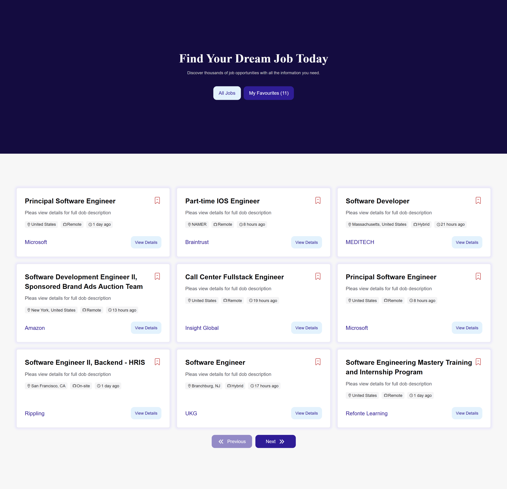
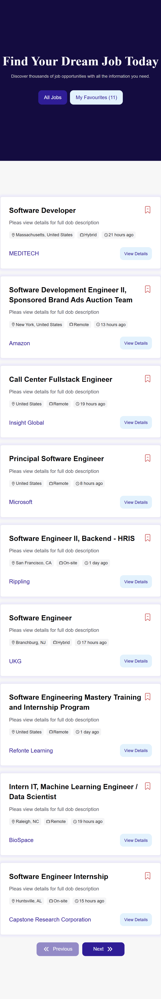
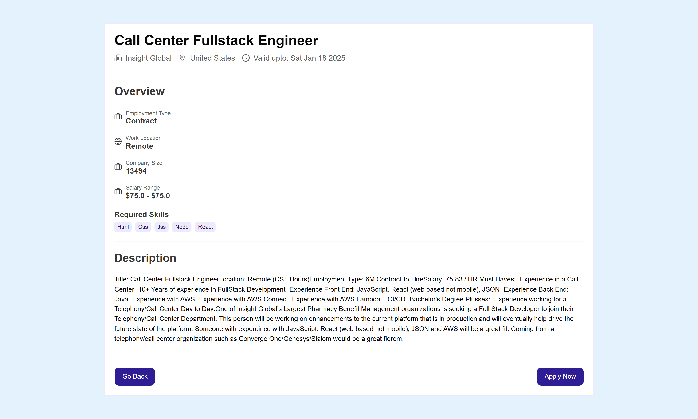
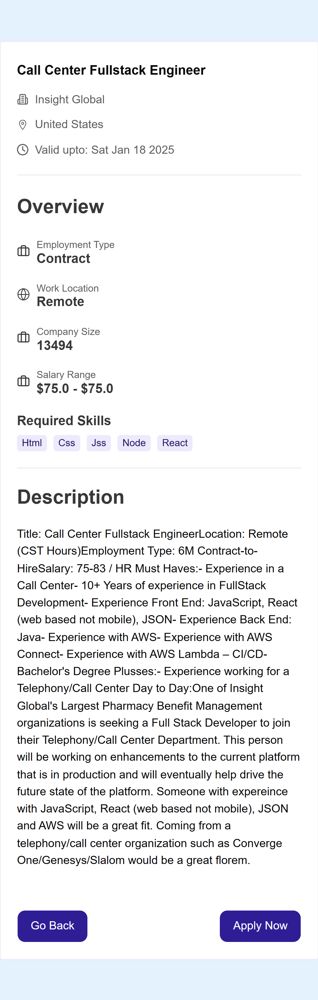
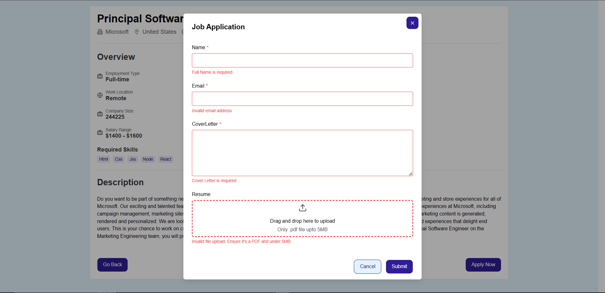
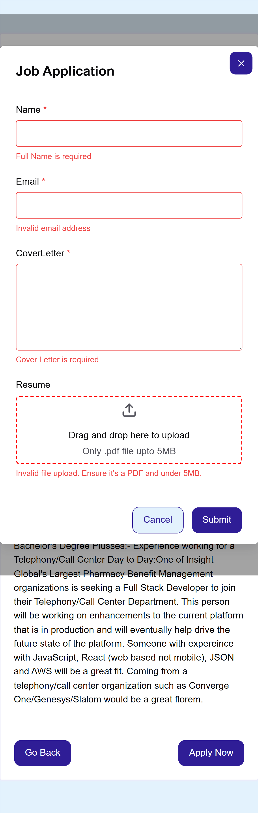

# Job Listing App 📝

A responsive job listing application built with **React** . This app allows users to view a list of jobs and favourite.

## Demo 🌐

https://job-listing-alpha-amber.vercel.app/

---

## Features ✨

- View job listings with details like title, company, location, and job type.
- Favourtie the job you like.
- View all jobs or favourite jobs selected by user.
- Job application form with validation in frontend.
- Responsive design for seamless use on any device.

---


## Tech Stack 🛠️

- **UI**: Chakra UI
- **Language**: TypeScript
- **Frontend library**: React
- **Routing**: react-router-dom
- **Data fetching**: Tanstack query, Axios
- **Form handling**: react-hook-form, zod
- **State Management**: zustand
- **Deployment**: Vercel

---

## Installation 🛠️

Follow these steps to run the app locally:

1. Clone the repository:
   ```bash
   git clone https://github.com/PradeepKKhanal/jobListing.git
   ```
   
2. Install dependencies:
   ```bash
   cd jobListing
   npm install
   ````

3. Start the development server:
   ```bash
   npm run dev
   ```

4. Run chakra theme to avoid any chance of issue
   ```bash
   npm run theme
   ```

5. Create .env file and get api key from https://linkedin-jobs-data-api.p.rapidapi.com (require sign up) then insert given command
   ```bash
   VITE_JOB_API_KEY=<Your_API_key>
   ```
---

## Screenshots 📸


### Job Listing Desktop View Page


<!--  -->

### Job Listing Mobile View Page

<!--  -->

### Job Details Desktop View Page

<!--  -->

### Job Details Mobile View Page

<!--  -->

### Job Apply Form Desktop View Page

<!--  -->

### Job Apply Form Mobile View Page

<!-- 
--- -->